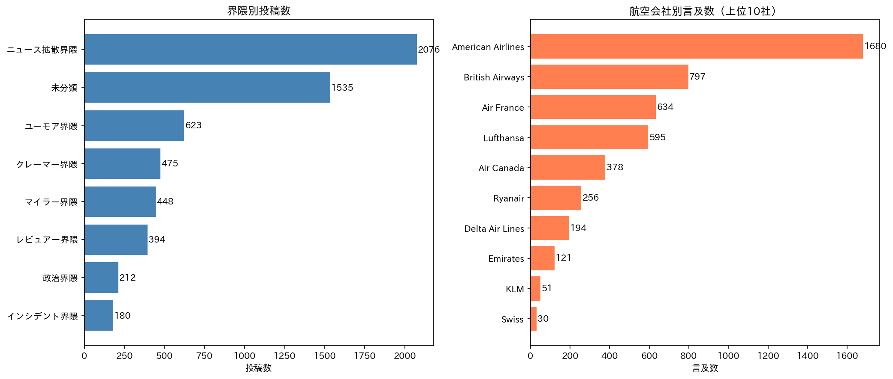

# 北米ビジネスクラスX発話 界隈分析レポート

## 基本統計

| 項目 | 値 |
|------|-----|
| 総投稿数 | 4,453 件 |
| 平均文字数 | 340.2 文字 |
| 最大文字数 | 8,834 文字 |
| 最小文字数 | 27 文字 |

---

## 航空会社別言及数

| 順位 | 航空会社 | 言及数 |
|------|----------|--------|
| 1 | American Airlines | 1680 |
| 2 | British Airways | 797 |
| 3 | Air France | 634 |
| 4 | Lufthansa | 595 |
| 5 | Air Canada | 378 |
| 6 | Ryanair | 256 |
| 7 | Delta Air Lines | 194 |
| 8 | Emirates | 121 |
| 9 | KLM | 51 |
| 10 | Swiss | 30 |
| 11 | Air India | 12 |
| 12 | United Airlines | 10 |
| 13 | Iberia | 9 |

---

## 界隈別分析

### 界隈別投稿数

| 界隈 | 投稿数 | 説明 |
|------|--------|------|
| ニュース拡散界隈 | 2076 | ニュースのRT・引用をするユーザー |
| 未分類 | 1535 | - |
| ユーモア界隈 | 623 | ジョーク・ユーモアを交えて投稿するユーザー |
| クレーマー界隈 | 475 | 苦情・不満を投稿するユーザー |
| マイラー界隈 | 448 | マイル・ポイント活用に関心があるユーザー |
| レビュアー界隈 | 394 | レビュー・体験共有をするユーザー |
| 政治界隈 | 212 | 政治的な言及をするユーザー |
| インシデント界隈 | 180 | 機内でのトラブル・インシデントに言及するユーザー |

---

## 各界隈の代表的な投稿

### ニュース拡散界隈

1. False accusation or real story? https://t.co/NYw6BJYpVt QT @nypost: NYC CEO told ‘Men just do stuff like that,’ after fellow American Airlines passenger masturbated for an hour in first class: Lawsuit...

2. Surely calls for lots of duct tape? Trust me, it’s a lot more civilized where we plebs ride, way back in rows 90-99 with our knees rammed against our chests… https://t.co/ykuIaGe59Y QT @MikeSington: W...

3. His wife in the back is so real cause period she standing behind her man 😂 https://t.co/O7nW9C58V9 QT @ArtOfDialogue_: "I'm not going to let y'all disrespect me like that," Juvenile chooses to get off...

### ユーモア界隈

1. First-class passengers on British Airways' Boeing 747 have raised concerns about a redesign featuring windows in select lavatories. A female traveler heading to New York voiced unease over the absence...

2. His wife in the back is so real cause period she standing behind her man 😂 https://t.co/O7nW9C58V9 QT @ArtOfDialogue_: "I'm not going to let y'all disrespect me like that," Juvenile chooses to get off...

3. I actually like the windows. The bathroom already small and cramped and let a lil sun in there to make it feel less like you're in a prison https://t.co/UWOLWCGsBx QT @Turbinetraveler: Passengers flyi...

### クレーマー界隈

1. @lufthansa How can @lufthansa justify inconveniencing my 70-year-old father? Canceling his business class ticket to LA due to a strike without any warning or apology is simply unacceptable. It's time ...

2. His wife in the back is so real cause period she standing behind her man 😂 https://t.co/O7nW9C58V9 QT @ArtOfDialogue_: "I'm not going to let y'all disrespect me like that," Juvenile chooses to get off...

3. @lufthansa Worst airline out there - embarrassing business class

### マイラー界隈

1. Air France-KLM Flying Blue Promo Rewards: Business Class For 45K Miles https://t.co/D4F4TfsTos

2. The Iberia Airlines Club in Madrid which we were able to enjoy as an American Airlines customer was fantastic. @AmericanAir QT @BillMiami: The VIP lounge for American Airlines business class customers...

3. The American airline industry is in the dinosaur age when it comes to customer service. WiFi should be free at the very least for 1st and Business class. https://t.co/K04RrQtWI5 QT @MarioNawfal: 🇫🇷 AI...

### レビュアー界隈

1. Enjoying a Flight on Air Canada's Signature Business Class Service Vancouver - Ottawa https://t.co/5GkZDU1Rh9

2. Flying Solo in Air France First Class :) https://t.co/f2FPKOVTFm via @YouTube

3. @KaptainPetrovs @htTweets No question - terrible experience & his issue has been resolved, also when the refurb happens I’m sure this will change. That said the first class fare for that sector in Oct...

### 政治界隈

1. @NorthrnPrspectv 'Nuff said: https://t.co/mjZ7DmJuIP QT @Trudeaus_Ego: This morning, Minister of Pensions @theJagmeetSingh was caught living like the average Joe. While sitting in a $5,000 First Class...

2. Google! No! Bad! https://t.co/XzpkNVoxfQ https://t.co/ZS0xwoexAV QT @libsoftiktok: NEW: First class passenger alleges that American Airlines bumped him to make room for Joe Biden https://t.co/Gh47Cxqx...

3. No respect these days QT @whatsn2day: Trump loyalist in MAGA hat says she was discriminated against in first class on American Airlines flight: A conservative journalist claimed she was discriminated ...

### インシデント界隈

1. Surely calls for lots of duct tape? Trust me, it’s a lot more civilized where we plebs ride, way back in rows 90-99 with our knees rammed against our chests… https://t.co/ykuIaGe59Y QT @MikeSington: W...

2. Chaos in American Airlines business class as passenger is thrown to the floor by flight attendant she then threatens to ‘kick in the balls’ #AmericanAirlines #Flightattendant https://t.co/yMV0h7uX36

3. American Airlines flight diverted after first-class passenger starts openly vaping: report ⁦⁦@Heather_Poole⁩ https://t.co/jEcAilACex

---

## 分析手法

- **手法**: キーワードベース分類
- **分類ルール**: 各界隈に定義されたキーワード・正規表現パターンにマッチする投稿を該当界隈に分類
- **複数該当**: 1つの投稿が複数の界隈に該当する場合あり
- **未分類**: どの界隈にも該当しなかった投稿

---

## 可視化

